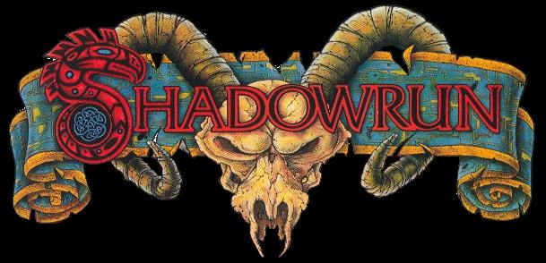
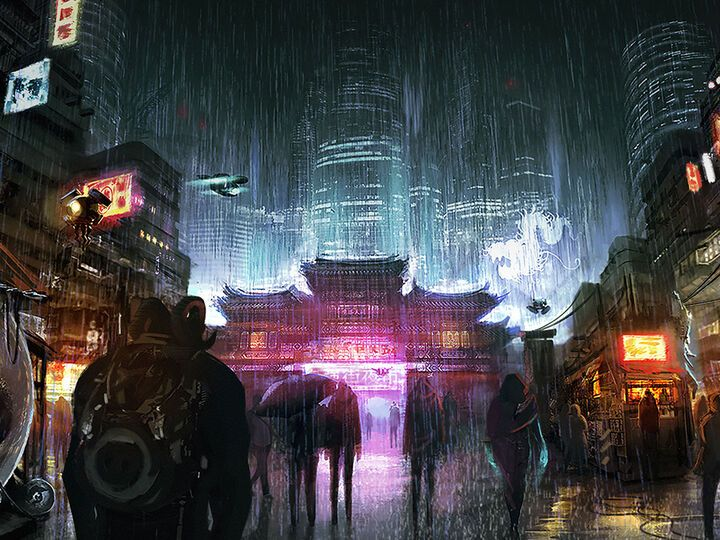

# ShadowRun Adaptation  
### **Platform for Russian, Mongolian, Kazakh, and Belarusian Users**  

  

## **Project Overview**  
This platform is designed to help non-native English speakers engage with the **Shadowrun** tabletop RPG by providing:  
- 📖 **Rulebooks & Guides** (translated/adapted content)  
- 🎭 **Character Creation Tools** (simplified and localized)  
- 📢 **Community Hub** for sharing photos, homebrew content, and guides  

Built as a **portfolio project** to showcase C# and web development skills.  

---

## **Tech Stack**  
### Backend  
- **C#** with **ASP.NET Core**  
- **Entity Framework Core** (database management)  
### Frontend  
- **HTML/CSS/JavaScript** (+ JS frameworks for dynamic content)  

---

## **Motivation**  
A passion project to:  
1. Improve my **C#/ASP.NET Core** expertise  
2. Address language barriers for Shadowrun fans in **Russian-speaking and Central Asian regions**  
3. Create a community-driven resource for a game I love  

---

## **About Shadowrun**  
  

### **The World of Shadowrun**  
Shadowrun blends **cyberpunk dystopia** with **high fantasy** in a unique "Sixth World" setting:  
- **Timeline**: 2050s and beyond, where magic reawakens in 2012  
- **Key Themes**: Corporate greed, street gangs, cyberware, and ancient spirits  
- **Gameplay**: Players are "shadowrunners" - mercenaries tackling illegal jobs  

### **Unique Features**  
- **Metahumans**: Elves, dwarves, orks, and trolls  
- **Cyberdeck Hackers**: Digital warfare in the Matrix  
- **Awakened**: Mages and shamans wielding magic  

### **Why It's Special**  
The only RPG that combines **gunfights, spellcasting, and corporate espionage** so seamlessly.  

---

## **Project Goals**  
✅ Localized character creation tools  
✅ Crowdsourced rules/lore translations  
✅ User-generated content platform  

**Future Plans**: Discord integration, GM tools, mobile support  

--- 

✨ **Join the shadows. The run begins now.** ✨  

--- 

*(Note: Shadowrun is a trademark of Catalyst Game Labs. This project is unofficial and for educational purposes.)*  